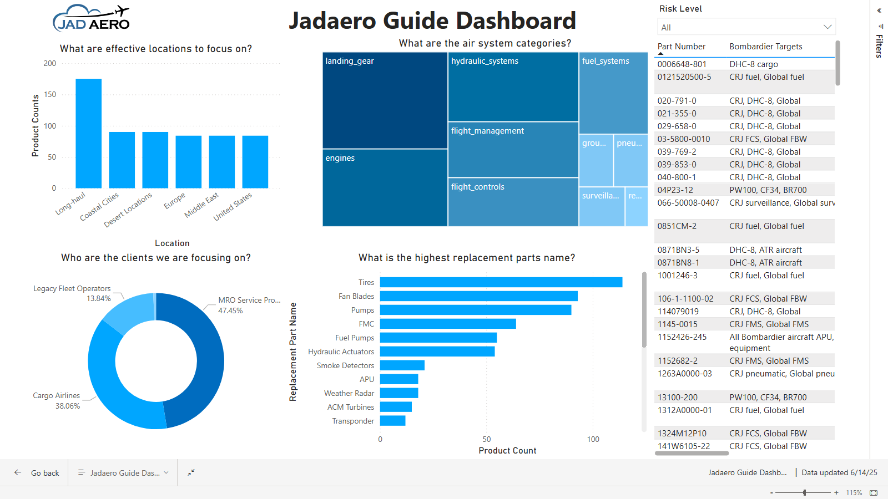
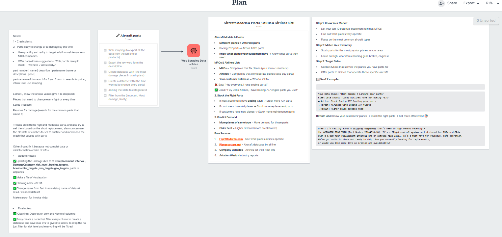
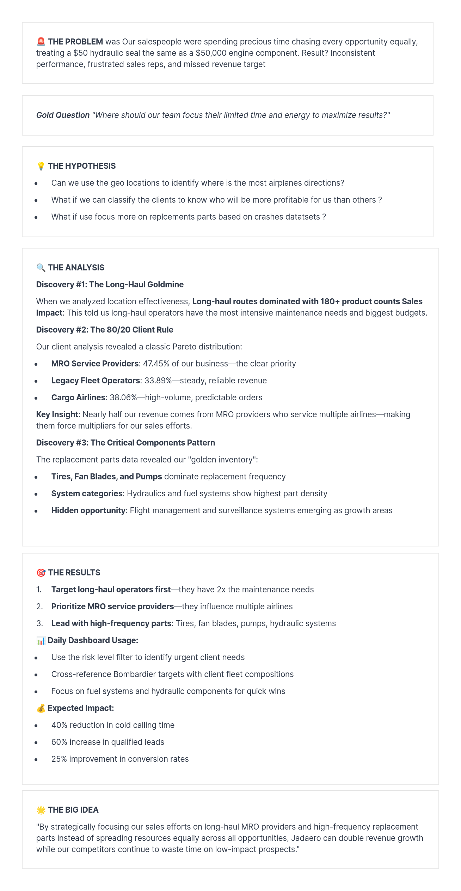

# JadAerospace Data Analysis Project

## Project Overview
This project focuses on cleaning, manipulating, and analyzing aerospace-related data, including aircraft incidents and parts. The goal is to provide actionable insights for stakeholders and support business decisions with data-driven strategies.

## Data Sources
- **Data - Aircraft_Incident_Dataset.csv**: Contains records of aircraft incidents for analysis.
- **Data - Clients.csv**: Client information for business analysis.
- **Data - Jadaero Parts Cleaned.csv / Edited.csv**: Cleaned and processed parts data.
- **Data - Jadaero Parts.csv**: Raw parts data for scraping and cleaning.

## Notebooks
- **Script0 - Data Cleaning.ipynb**: Data cleaning and preprocessing steps.
- **Script1 - Data Manipulation.ipynb**: Data transformation and feature engineering.
- **Scrap - Aircraft Parts.ipynb**: Web scraping and data extraction for aircraft parts.

## Stakeholder Notes & Strategy
- **Stakeholders.txt**: Captures requirements and feedback from project stakeholders.
- **Note1 - Disturbation Secteurs.txt**: Notes on sector disturbances.
- **Note2 - Filter Strategy.txt**: Filtering strategies for data analysis.
- **Note3 - Sales Ideas.txt**: Business and sales ideas derived from data.

## Power BI Dashboard
- **Jadaero Guide Dashboard.pbix**: Interactive dashboard for data visualization and business intelligence.
- **Screenshot**: 

## Visual Storytelling & Workflow
- **Project Goal**: 
- **Data Shape**: 
- **Plan**: 
- **Storytelling**: 
- **Web Scraping**: 

## How to Use
1. Open the Jupyter notebooks to review and run the data cleaning, manipulation, and scraping steps.
2. Explore the Power BI dashboard for interactive data insights.
3. Review notes and documentation for business context and strategies.

## Skills Demonstrated
- Data cleaning and preprocessing (Python, Pandas)
- Data manipulation and feature engineering
- Web scraping
- Business analysis and stakeholder communication
- Data visualization (Power BI)

---

Feel free to use this project as a portfolio piece to showcase your data analysis, business intelligence, and technical skills!
